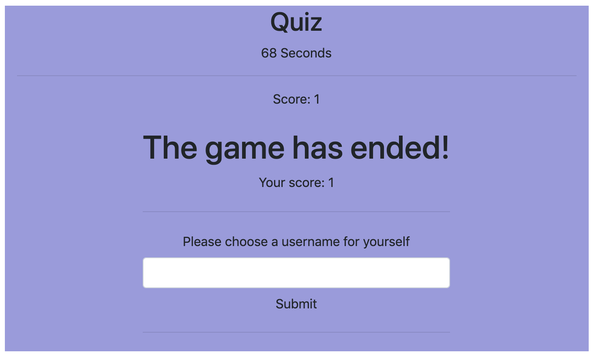

# Code Quiz 

Created by me: *Danielle Hillman*
Link to deployed application: https://daniellehillman.github.io/codequiz/

## This quiz allows the user to answer multiple choice questions under the pressure of a timer. 

The timer starts at 90 and if the user answers a question wrong, 10 seconds are deducted from the timer. A correct question will increase the user's score.

## Main Points 

This program utlizes functions and event listeners to iterate over the questions depending on what answer the user chooses. Once the game is over, the timer stops and the score is shown.

## Scoreboard
After the user has completed the quiz, a input form allows them to store the username and score to local storage to then be ranked.

## Future Updating
In the future more questions can be added since they are itterated through with a function.